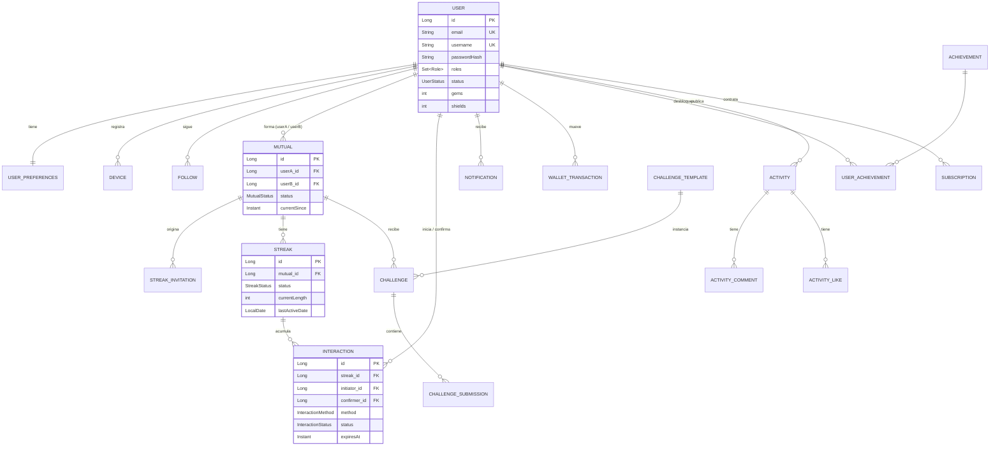

# Mutuals: rachas verificadas para mantener amistades reales

**Curso:** CS 2031 Desarrollo Basado en Plataforma · UTEC · Ciclo 2026-2
**Profesor:** Jorge Villavicencio Antunez

| Integrante | Código |
| --- | --- |
| Oriana Manuela Fe Manrique Romero | 202320149 |
| Ashly Nicole Veliz Barba | 202210422 |
| Jhanpiere Alejandro Montes Quispe | 202210413 |

**API desplegada:** `http://<IP-PUBLICA-EC2>` · Swagger: `http://<IP-PUBLICA-EC2>/swagger-ui.html`
**Colección de Postman:** [`postman_collection.json`](postman_collection.json)

---

## Índice

1. [Introducción](#1-introducción)
2. [Identificación del problema](#2-identificación-del-problema)
3. [Descripción de la solución](#3-descripción-de-la-solución)
4. [Modelo de entidades](#4-modelo-de-entidades)
5. [Manejo de errores](#5-manejo-de-errores)
6. [Medidas de seguridad](#6-medidas-de-seguridad)
7. [Eventos y asincronía](#7-eventos-y-asincronía)
8. [GitHub y gestión del proyecto](#8-github-y-gestión-del-proyecto)
9. [Ejecución local y despliegue](#9-ejecución-local-y-despliegue)
10. [Conclusión](#10-conclusión)
11. [Apéndices](#11-apéndices)

---

## 1. Introducción

### Contexto

Las redes sociales miden la amistad con seguidores y "me gusta", pero ninguna indica si de verdad seguimos en contacto
con las personas que nos importan. Entre la universidad, el trabajo y los horarios cruzados, es fácil que pasen semanas
sin hablar con un amigo cercano sin darnos cuenta. Las "rachas" de otras aplicaciones demostraron que un contador diario
motiva a volver, pero se pueden mantener enviando una foto en negro: miden actividad, no conexión.

### Objetivos del proyecto

- Construir una API REST que permita a dos amigos mantener una racha diaria **confirmada por ambas partes**.
- Ofrecer formas de verificar la interacción: confirmación manual, código QR rotativo y proximidad por GPS.
- Motivar el hábito con gamificación: escudos que protegen la racha, gemas, logros, retos semanales y un resumen
  periódico ("Wrapped").
- Notificar a tiempo cuando una racha está en riesgo, sin bloquear las peticiones del usuario.
- Entregar un backend seguro, probado, documentado y desplegado en AWS.

## 2. Identificación del problema

### Descripción del problema

Las personas quieren mantener vivas sus amistades cercanas, pero no tienen una señal clara de qué tan activo está cada
vínculo ni un recordatorio antes de que se enfríe. Las herramientas actuales registran interacciones de un solo lado y
no distinguen entre amigos cercanos y contactos casuales.

### Justificación

La calidad de las relaciones cercanas está asociada al bienestar y la salud mental, y la soledad en adultos jóvenes es un
problema creciente. Un sistema que haga visible el estado de cada amistad y que exija la confirmación de ambos convierte
la racha en una evidencia real de contacto y no en un número inflado. Además, limitar las rachas activas del plan gratuito
a cuatro obliga a priorizar a las personas importantes.

## 3. Descripción de la solución

### Funcionalidades implementadas

| Funcionalidad | Cómo aporta a la solución |
| --- | --- |
| Registro, login, refresh y recuperación de contraseña | Cuenta segura con JWT y correo de restablecimiento. |
| Seguir usuarios y **mutuals** | Cuando dos personas se siguen mutuamente se crea un `Mutual`; solo los mutuals pueden tener racha. |
| Invitaciones de racha | Una racha empieza solo si el amigo acepta; se respeta el límite del plan. |
| Interacciones con confirmación mutua | Un usuario registra la interacción y el otro la confirma o rechaza en 24 horas. |
| Check-in por QR y por proximidad | El QR cambia cada 30 s y está firmado con HMAC; la proximidad valida distancia (100 m) y tiempo (120 s). |
| Rachas, historial y escudos | El contador sube con cada día confirmado; un escudo evita que se rompa un día. |
| Billetera, gemas y regalos | Se ganan gemas por semanas completas y se compran o regalan escudos. |
| Logros, avatar y retos semanales | Gamificación que premia la constancia. |
| Feed de actividad, likes y comentarios | Timeline de momentos compartidos entre amigos. |
| Notificaciones en la app y push (FCM) | Avisos de racha en riesgo, invitaciones y confirmaciones. |
| Wrapped mensual y anual | Resumen de estadísticas por usuario y de la plataforma. |
| Suscripción Plus | Rol `PREMIUM` con más rachas y el Wrapped histórico. |
| Panel de administración | Métricas, moderación de reportes, suspensión de cuentas y gestión de retos. |

### Tecnologías utilizadas

- **Lenguaje y framework:** Java 21, Spring Boot 3.5 (Web, Data JPA, Security, Validation, Mail, Actuator).
- **Base de datos:** PostgreSQL 16 (Docker en local, Amazon RDS en producción); H2 para las pruebas.
- **Seguridad:** Spring Security, JJWT 0.12, BCrypt.
- **Correo:** JavaMailSender con plantillas Thymeleaf; Mailpit para pruebas locales.
- **Servicios externos:** Firebase Cloud Messaging (push), Amazon S3 (imágenes, opcional).
- **Documentación:** springdoc-openapi (Swagger UI) y Postman.
- **Infraestructura:** Docker, Docker Compose, GitHub Actions, AWS EC2 y RDS.
- **Pruebas:** JUnit 5, Mockito, Spring Boot Test y JaCoCo.

### Arquitectura

```mermaid
flowchart LR
    Client[App móvil / web] -->|HTTPS + JWT| Filter[JwtAuthenticationFilter]
    Filter --> Controller[Controllers /api/v1]
    Controller --> Service[Services]
    Service --> Repository[Repositories JPA]
    Repository --> DB[(PostgreSQL / RDS)]
    Service -->|publishEvent| Events{{Eventos de dominio}}
    Events -->|@Async| Email[EmailService SMTP]
    Events -->|@Async| Push[PushSender FCM]
    Events -->|@Async| Achievements[Logros y actividad]
    Scheduler[Jobs @Scheduled] --> Service
```

El código está organizado **por dominio** (`auth`, `user`, `social`, `streak`, `economy`, `challenge`, `achievement`,
`avatar`, `activity`, `notification`, `wrapped`, `subscription`, `admin`) y cada dominio respeta la separación
`controller → service → repository`, con `dto` y `mapper` propios. Los controladores validan con `@Valid` y delegan;
la lógica vive en servicios enfocados (`StreakProgressService`, `StreakTerminationService`, `StreakMaintenanceService`).
Las dependencias se inyectan por constructor y `PushSender` y `StorageService` son interfaces cuya implementación se
elige por configuración.

## 4. Modelo de entidades

El modelo tiene **28 entidades** JPA. El diagrama muestra el núcleo del negocio:



### Descripción de las entidades principales

- **User:** cuenta con email y username únicos, contraseña cifrada, roles (`USER`, `PREMIUM`, `ADMIN`), estado
  (activa o suspendida), gemas y escudos. Se relaciona 1:1 con `UserPreferences`, `ProfileCustomization` y
  `UserLocation`, y 1:N con `Device`, `RefreshToken` y `Notification`.
- **Follow / Mutual / Block / Report:** el grafo social. Un `Mutual` une a dos usuarios que se siguen mutuamente y guarda
  la pareja ordenada (`userA` < `userB`) con una restricción única para evitar duplicados.
- **StreakInvitation / Streak / Interaction:** el corazón del negocio. Una invitación aceptada crea una `Streak` sobre
  un `Mutual`; cada `Interaction` pertenece a una racha, tiene iniciador y confirmador, método (`MANUAL`, `QR`,
  `PROXIMITY`) y vence si no se confirma a tiempo.
- **WalletTransaction:** libro contable de gemas y escudos, con contraparte opcional para regalos.
- **Achievement, UserAchievement, AvatarItem, UserAvatarItem:** catálogo y desbloqueos de gamificación.
- **ChallengeTemplate, Challenge, ChallengeSubmission:** retos semanales asignados a cada mutual.
- **Activity, ActivityLike, ActivityComment:** feed social.
- **Notification, Device:** notificaciones persistidas y tokens de FCM.
- **Subscription, WrappedSummary, PasswordResetToken:** plan Plus, resúmenes y recuperación de cuenta.

Todas las relaciones `@ManyToOne` y `@OneToOne` usan `FetchType.LAZY`; los agregados dependientes (preferencias,
personalización, envíos de un reto) usan `cascade = ALL` con `orphanRemoval`. Hay índices en las columnas más consultadas
(estado de rachas, fecha de interacciones, notificaciones no leídas) y restricciones únicas a nivel de base de datos.
En la capa de aplicación se valida con `@NotBlank`, `@Email`, `@Size`, `@Pattern`, `@Min`, `@Max` y la anotación
propia `@StrongPassword`.

## 5. Manejo de errores

Todas las excepciones de negocio heredan de `ApiException`, que define el código HTTP y un código de error legible.
Existen **18 excepciones propias** agrupadas por categoría: recurso no encontrado (`ResourceNotFoundException`),
conflictos (`DuplicateResourceException`, `ConflictException`, `ActiveStreakConflictException`), operaciones inválidas
(`InvalidOperationException`, `InvalidCheckInException`, `InvalidQrTokenException`, `InteractionExpiredException`,
`InsufficientBalanceException`, `PlanLimitExceededException`), autenticación (`InvalidCredentialsException`,
`InvalidTokenException`, `UnauthorizedException`, `AccountSuspendedException`), autorización
(`ForbiddenOperationException`, `UserBlockedException`) y almacenamiento (`StorageException`).

`GlobalExceptionHandler` (`@RestControllerAdvice`) captura además las excepciones de Spring: validación de cuerpo y
parámetros, JSON mal formado, tipos incorrectos, archivos demasiado grandes, autenticación, acceso denegado, violaciones
de integridad, método no soportado y rutas inexistentes. Cualquier error devuelve el mismo `ErrorResponse`:

```json
{
  "timestamp": "2026-09-25T15:30:00Z",
  "status": 409,
  "error": "Conflict",
  "message": "Email is already registered",
  "path": "/api/v1/auth/register"
}
```

Manejar los errores de forma centralizada evita filtrar trazas internas (`include-stacktrace: never`), da al cliente
códigos coherentes (400, 401, 403, 404, 409, 413, 500) y mantiene los controladores libres de `try/catch`.

## 6. Medidas de seguridad

### Seguridad de datos

- **Autenticación JWT stateless:** el login devuelve un access token de 15 minutos firmado con HMAC-SHA y un refresh
  token de 30 días. El token incluye `sub` (email), `userId` y `roles`. `JwtAuthenticationFilter` lo valida en cada
  petición, revisa la expiración y carga el usuario con `CustomUserDetailsService`.
- **Refresh tokens con rotación:** se guardan como hash SHA-256 y se revocan al usarse y al cerrar sesión; si alguien reutiliza uno ya usado, se revocan todas las sesiones del usuario.
- **Contraseñas con BCrypt** y política de contraseña fuerte (8 a 72 caracteres con mayúscula, minúscula, número y símbolo).
- **Roles en base de datos y en el token:** `USER`, `PREMIUM` y `ADMIN`, verificados con `@PreAuthorize` y reglas en
  `SecurityConfig`; los servicios comprueban además que el usuario sea parte de la racha o interacción.
- **Secretos en variables de entorno:** `JWT_SECRET`, `QR_SECRET` y credenciales nunca están en el repositorio.
- **Privacidad de ubicación:** la ubicación requiere consentimiento explícito y se elimina tras 10 minutos.

### Prevención de vulnerabilidades

- **Inyección SQL:** todo acceso a datos usa Spring Data JPA con consultas parametrizadas.
- **XSS:** la API solo devuelve JSON; las plantillas de correo usan Thymeleaf, que escapa el contenido por defecto.
- **CSRF:** desactivado de forma consciente porque la API es stateless y no usa cookies de sesión.
- **CORS:** solo se aceptan los orígenes configurados en `CORS_ALLOWED_ORIGINS`.
- **Subida de archivos:** se valida el tipo de imagen permitido, el tamaño máximo (5 MB) y que la ruta de destino no salga de la carpeta de uploads.
- **Fuga de datos:** los DTO nunca exponen `passwordHash`, tokens ni ubicación exacta.
- **QR:** los códigos están firmados con HMAC y expiran en 30 segundos.

## 7. Eventos y asincronía

El sistema publica **22 eventos de dominio** con `ApplicationEventPublisher`, entre ellos `UserRegisteredEvent`,
`PasswordResetRequestedEvent`, `MutualCreatedEvent`, `StreakInvitationCreatedEvent`, `InteractionPendingEvent`,
`InteractionConfirmedEvent`, `StreakMilestoneReachedEvent`, `StreakAtRiskEvent`, `StreakBrokenEvent`, `ShieldUsedEvent`,
`AchievementUnlockedEvent`, `ChallengeAssignedEvent`, `WrappedGeneratedEvent` y `SubscriptionActivatedEvent`.

Los listeners usan `@TransactionalEventListener` para ejecutarse **solo después del commit**: así no se envía una
notificación de una interacción cuya transacción terminó en rollback. Cada dominio reacciona por separado:
`EmailEventListener` envía correos HTML, `NotificationEventListener` guarda la notificación y envía el push,
`AchievementEventListener` evalúa logros y `ActivityEventListener` publica en el feed. El servicio de rachas no conoce
a ninguno de ellos, lo que mantiene el bajo acoplamiento.

Los listeners son `@Async` y corren en un `ThreadPoolTaskExecutor` propio (4 a 8 hilos, cola de 100). Enviar un correo
por SMTP o un push a Firebase puede tardar segundos o fallar; si fuera síncrono, el usuario esperaría o recibiría un error
por un servicio externo. Los errores asíncronos se registran con SLF4J sin afectar la respuesta.

Además, nueve jobs `@Scheduled` (zona America/Lima) expiran interacciones pendientes, cierran el día de las rachas,
avisan a las 20:00 de las que están en riesgo, asignan retos, generan el Wrapped y limpian datos vencidos.

El correo cubre las operaciones importantes con cuatro plantillas: bienvenida al registrarse, recuperación de contraseña,
activación de la suscripción y Wrapped listo.

## 8. GitHub y gestión del proyecto

- **GitHub Projects e Issues:** cada funcionalidad se registró como issue con etiquetas (`feature`, `bug`, `docs`,
  `devops`, `testing`) y un responsable, organizada en un tablero (*Todo → In progress → Done*) y en milestones por
  entrega (*Entrega 1: propuesta*, *Semana 7: backend*).
- **Flujo de ramas:** `master` contiene la versión estable; cada cambio se desarrolla en una rama `feature/*`, `fix/*`
  o `docs/*`, se abre un pull request que referencia su issue (`Closes #n`) y se integra después de la revisión de otro
  integrante.
- **GitHub Actions:** el workflow [`ci.yml`](.github/workflows/ci.yml) se ejecuta en cada push y pull request a
  `master` y `develop`. Configura Java 21, compila, ejecuta las pruebas unitarias y de integración con `mvn verify` y
  publica el reporte de cobertura de JaCoCo como artefacto. Un pull request con pruebas fallidas no se integra.
- **Higiene del repositorio:** `.gitignore` excluye `.env`, credenciales, `target/` y `uploads/`.

## 9. Ejecución local y despliegue

### Requisitos

Java 21, Maven 3.9+ y Docker Desktop.

```bash
cp .env.example .env              # cambia JWT_SECRET y QR_SECRET
docker compose up -d db mail      # PostgreSQL (5433) y Mailpit (8025)
mvn spring-boot:run               # API en http://localhost:8080
```

- Swagger UI: http://localhost:8080/swagger-ui.html
- Correos de prueba: http://localhost:8025
- Todo en contenedores: `docker compose --profile full up --build`
- Pruebas y cobertura: `mvn verify` (reporte en `target/site/jacoco/index.html`)

### Variables de entorno

| Variable | Descripción |
| --- | --- |
| `DB_URL`, `DB_USERNAME`, `DB_PASSWORD` | Conexión a PostgreSQL (RDS en producción) |
| `JWT_SECRET`, `JWT_ACCESS_MINUTES`, `JWT_REFRESH_DAYS` | Firma y duración de los tokens |
| `QR_SECRET` | Firma de los códigos QR rotativos |
| `CORS_ALLOWED_ORIGINS`, `FRONTEND_URL` | Orígenes permitidos y URL de los enlaces del correo |
| `MAIL_HOST`, `MAIL_PORT`, `MAIL_USERNAME`, `MAIL_PASSWORD`, `MAIL_ENABLED` | Servidor SMTP |
| `PUSH_PROVIDER`, `FIREBASE_CREDENTIALS_PATH` | `log` o `fcm` |
| `STORAGE_PROVIDER`, `AWS_S3_BUCKET`, `AWS_REGION` | `local` o `s3` |
| `ADMIN_EMAIL`, `ADMIN_PASSWORD` | Usuario administrador creado al iniciar |

### Endpoints principales

| Recurso | Endpoints |
| --- | --- |
| Autenticación | `POST /auth/register`, `/auth/login`, `/auth/refresh`, `/auth/logout`, `/auth/password-reset`, `/auth/password-reset/confirm` |
| Usuarios | `GET/PATCH/DELETE /users/me`, `/users/me/preferences`, `/users/me/devices`, `GET /users/search`, `/users/{id}` |
| Social | `POST/DELETE /users/{id}/follow`, `GET /mutuals`, `POST/DELETE /users/{id}/block`, `POST /reports` |
| Rachas | `POST/GET /streak-invitations`, `PATCH/DELETE /streak-invitations/{id}`, `GET /streaks/history`, `GET /streaks/{id}`, `POST /streaks/{id}/shield` |
| Interacciones | `POST /interactions`, `POST /interactions/{id}/confirm`, `/reject`, `GET /interactions/pending`, `/timeline` |
| Check-in | `GET /qr-codes/me`, `POST /check-ins/qr`, `/check-ins/proximity`, `POST /locations` |
| Economía | `GET /wallet`, `/wallet/transactions`, `POST /shields/purchase`, `/shields/gifts` |
| Gamificación | `GET /achievements`, `/avatar-items`, `/challenges`, `POST /challenges/{id}/submissions` |
| Social feed | `GET /activities`, `POST/DELETE /activities/{id}/likes`, `GET/POST /activities/{id}/comments` |
| Notificaciones | `GET /notifications`, `/notifications/unread-count`, `PATCH /notifications/{id}/read`, `/read-all` |
| Wrapped y Plus | `GET /wrapped`, `/wrapped/{periodKey}`, `/wrapped/all-time`, `GET/POST/DELETE /subscriptions` |
| Administración | `/admin/metrics`, `/admin/reports`, `/admin/users/{id}/status`, `/admin/challenge-templates` |

Todas las rutas llevan el prefijo `/api/v1`.

### Despliegue en AWS

La API corre en Docker sobre **EC2** (Amazon Linux 2023) y usa **Amazon RDS for PostgreSQL** sin acceso público.
El security group de RDS solo acepta conexiones desde el security group de EC2, y el de EC2 abre el puerto 80 al
público y SSH solo a la IP del equipo. Las variables de producción viven en un archivo `mutuals.env` fuera del
repositorio y se activa el perfil `prod`. La guía paso a paso está en [`docs/DEPLOY_AWS.md`](docs/DEPLOY_AWS.md).

## 10. Conclusión

### Logros del proyecto

Construimos un backend completo que convierte la racha en una prueba real de contacto: nadie puede sumar días sin la
confirmación de su amigo, ya sea manual, por QR o por proximidad. El sistema avisa antes de que una racha se pierda,
premia la constancia y ofrece a los administradores herramientas de moderación, todo con autenticación robusta,
errores uniformes, procesamiento asíncrono y despliegue en la nube.

### Aprendizajes clave

- Diseñar eventos transaccionales para que los efectos secundarios ocurran solo después del commit.
- Separar responsabilidades en servicios pequeños facilitó probar la lógica de rachas de forma aislada.
- Las zonas horarias importan: calcular "un día" en America/Lima y no en UTC evitó rachas rotas por error.
- Configurar la infraestructura (Docker, RDS, security groups) es tan importante como el código.

### Trabajo futuro

- Login social con Google y Apple mediante Firebase Authentication.
- Rachas grupales y espacios compartidos del campus (gimnasio, biblioteca).
- Pasarela de pago real para la suscripción Plus.
- Migraciones versionadas con Flyway y despliegue continuo automático a AWS.

## 11. Apéndices

### Licencia

Proyecto académico distribuido bajo la licencia MIT.

### Referencias

- Spring Boot Reference Documentation: https://docs.spring.io/spring-boot/
- Spring Security Reference: https://docs.spring.io/spring-security/reference/
- JJWT: https://github.com/jwtk/jjwt
- Thymeleaf: https://www.thymeleaf.org/documentation.html
- Amazon RDS for PostgreSQL: https://docs.aws.amazon.com/AmazonRDS/latest/UserGuide/CHAP_PostgreSQL.html
- OWASP Top 10: https://owasp.org/www-project-top-ten/
